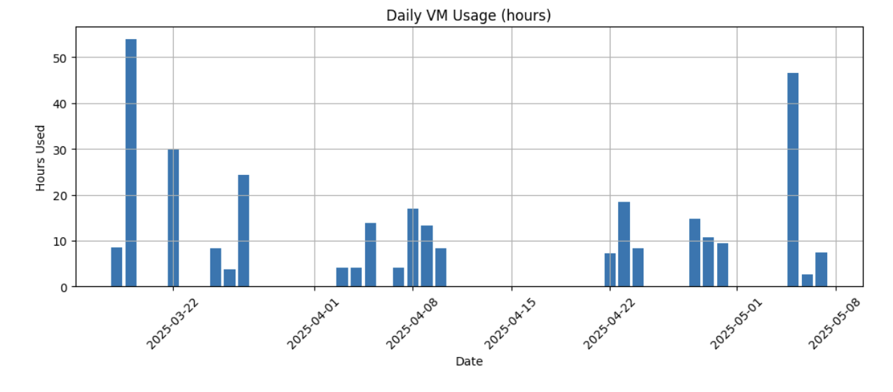
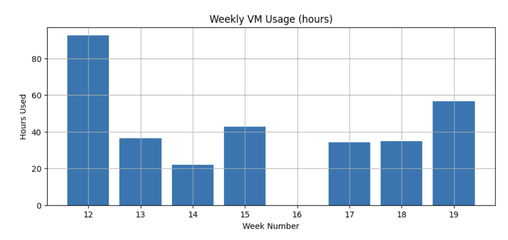
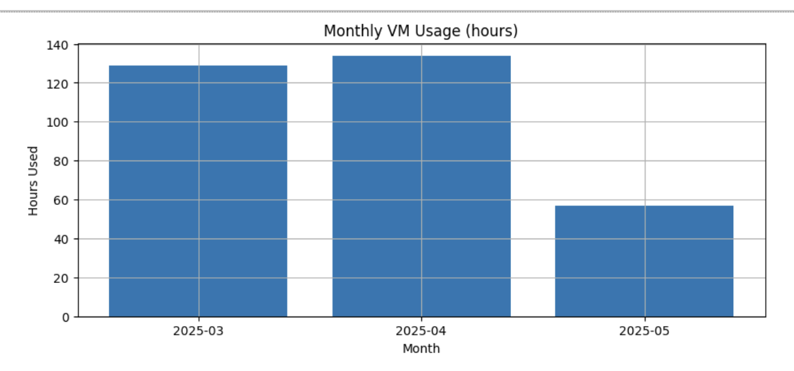

# pids-drg-vm-stats

This repository generates **daily, weekly, and monthly VM usage reports** (in hours) for the **eClaims VM**, **eClaims VM v2**, and the **STATA VM**, using logs exported from Google Cloud Logging.

The reports include visualizations of VM usage since the inception of each VM until present day.

**Last Updated:** December 2025

---

## Progress Since June 2025

### Key Accomplishments

| Date | Milestone |
|------|-----------|
| **Jun 2025** | Initial commit with basic log parsing |
| **Jul 2025** | Added README with setup/usage instructions |
| **Aug 2025** | Updated images with latest usage charts |
| **Sep 2025** | Added eClaims VM v2 support |
| **Oct 2025** | Wrote comprehensive `walkthrough.md` |
| **Nov-Dec 2025** | Updated sample outputs, refined chart generation |

### Current Status

- **VMs Tracked:** eClaims (v1), eClaims (v2), STATA
- **Log Sources:** Google Cloud Logging JSON exports
- **Reports Generated:** Daily, Weekly (ISO), Monthly usage charts
- **Output Format:** In-notebook matplotlib visualizations

---

## 📂 Repository Structure

```
pids-drg-vm-stats/
├── data/
│   └── inputs/
│       ├── eclaims.json   # Logs for eClaims VM
│       └── stata.json     # Logs for STATA VM
├── main.ipynb             # Notebook to process logs and generate reports
├── requirements.txt       # Python dependencies
└── README.md              # This file
```

---

## ⚙️ Setup

1. **Clone this repository**

   ```bash
   git clone https://github.com/pids-drg-team/pids-drg-vm-stats.git
   cd pids-drg-vm-stats
   ```

2. **Install required Python libraries**

   Run this once:

   ```bash
   pip install -r requirements.txt
   ```

   Required packages:

   - `pandas`
   - `matplotlib`

---

## 📥 Input Data

You’ll need to download Cloud Logging JSON logs for each VM:

- **eClaims VM**
  [Download logs here](https://cloudlogging.app.goo.gl/RbFvX2GVtRrEamaD8)
  Save as:

  ```
  data/inputs/eclaims.json
  ```

- **eClaims VM v2**
  [Download logs here](https://cloudlogging.app.goo.gl/ksdz79DERaatzKEp6)
  Save as:

  ```
  data/inputs/eclaims-v2.json
  ```

- **STATA VM**
  [Download logs here](https://cloudlogging.app.goo.gl/qfMqdAv79nZ8cmha7)
  Save as:

  ```
  data/inputs/stata.json
  ```

---

## ▶️ Usage

1. Open **VS Code**

   - Install the **Python** extension and **Jupyter** extension.
   - Open the cloned repository folder in VS Code.

2. Open **`main.ipynb`**

   - Select a Python kernel.
   - Run all cells.

3. The notebook will:

   - Parse the log files (`eclaims.json` and `stata.json`)
   - Compute VM usage sessions from **start** / **stop** events
   - Aggregate results into **daily**, **weekly**, and **monthly** summaries
   - Generate bar chart visualizations

---

## 📊 Sample Output

Here’s an example of the generated reports for the **eClaims VM** (as of June 25, 2025):

**Daily VM Usage**


**Weekly VM Usage**


**Monthly VM Usage**


---

## 🔍 Notes

- Only `start` (`v1.compute.instances.start`) and `stop` (`v1.compute.instances.stop`) events are used.
- Usage is calculated as the difference between each start–stop pair.
- Hours are aggregated into **daily**, **weekly (ISO week number)**, and **monthly (YYYY-MM)** buckets.

---

## 👥 Contacts

For updated input files (VM logs), contact the **PIDS Health Team**.
